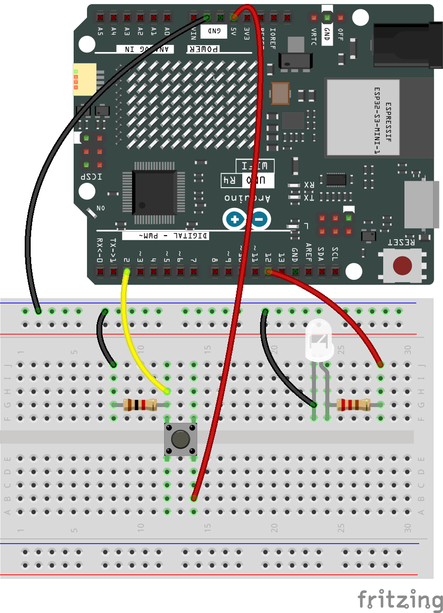

# Toggle Button and Debounce

## Why debouncing a button

Debouncing is often necessary for pushbuttons and switches.

When you press or release a button, the physical properties of the button can cause the electrical connectivity to "bounce" from on to off, and off to on, multiple times in a very short duration. This "bouncing" can lead the Arduino to believe that the button has been pressed or released more times than it actually has been.
The effect of this could be like rapidly turning a light switch on and off, even if you had only intended to change the state once.
Debouncing is a mechanism to mitigate this problem. A simple debouncing technique, like the one implemented in the provided code, waits for a short period after detecting the button press or release to see if the button's state stablizes, thereby confirming that the button press/release is genuine and not just a result of "bouncing".
Ignoring debouncing may lead to erratic behavior on any system waiting for a clean digital input.
For complex projects where instantaneous button input readings are crucial, hardware debouncing or more advanced software debouncing algorithms can be used.

> [!TIP]
> A way better non blocking implementation of debouncing can be found [here](https://docs.arduino.cc/built-in-examples/digital/Debounce).
> For the sake of the simplicity of the workshop we use this blocking implementation.
